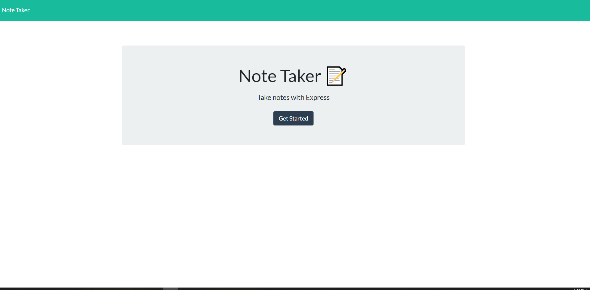
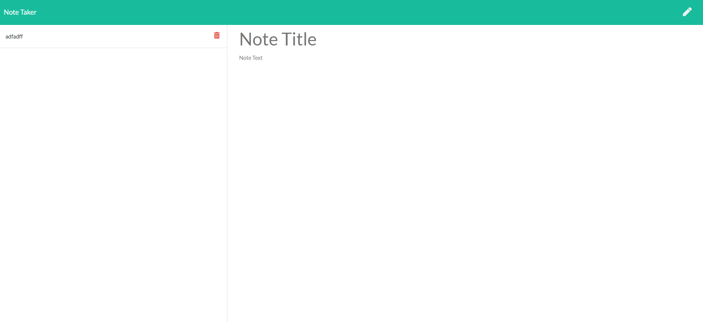

 

 # Licence
  
  >  
     * select the license badge to view licence aggreements:

     

  ### :octocat:
  ### node js :package: 

# NoteKeeper

* a software engineering team generator command line application
* node CLI to create a team html output using node js modules inquirer, path, and fs
* A library of individual classes for each type of employee where used to create and pass the information
    gathered to render the view (html)

# Table of Contents
  <!-- toc -->
  * [Description](#description)
  * [Installation](#installation)
  * [Usage](#usage)
  * [Contributors](#contributors)
  * [GitHub Information](#github-information)
  * [Questions](#questions)
  * [Credits](#credits)
  * [Testing](#testing)
   <!-- toc stop -->

# Description

> This application is used to write, save, and delete notes. This application uses an express backend and save and retrieve note data from a JSON file

# Installation

>No installation for the deployed version can  
 be found on Heroku at:
 https://whispering-atoll-65398.herokuapp.com/

# Usage

 **As a User:**
>   AS A user, I want to be able to write and 
  save notes

  I WANT to be able to delete notes I've written before

  SO THAT I can organize my thoughts and keep track of tasks I need to complete

  

#### **User input**

For users that need to keep track of a lot of information, it's easy to forget or be unable to recall something important. Being able to take persistent notes allows users to have written information available when needed.

#### **API usages**

The application has a `db.json` file on the backend that will be used to store and retrieve notes using the `fs` module.

*API routes:

  * GET `/api/notes` - reads the `db.json` file and return all saved notes as JSON.

  * POST `/api/notes` - receives a new note to save on the request body, add it to the `db.json` file, and then return the new note to the client.

  * DELETE `/api/notes/:id` - receives a query parameter containing the id of a note to delete. there is also a  unique `id` when a note is saved. Read all notes from the `db.json` file, remove the note with the given `id` property, and then rewrite the notes to the `db.json` file.

# Contributors

#### askBCS Learning assistant @iarcones "Thanks again" :)
#### @Carl Vega [TA] thanks for giving the code a second look for me!

 ## **GitHub Information**
 
  # '''' https://github.com/victorsc45 ''''

  Picture of Developer: 

  
  
  ## *Questions*

  > questions or comments contact me by email : 

     
  ####  victorlitzau+github@gmail.com

 ### Credits

#### https://www.w3schools.com/jsref/jsref_splice.asp
#### https://developer.mozilla.org/en-US/docs/Web/JavaScript/Reference/Global_Objects/Array/findIndex
#### https://stackoverflow.com

# Testing

**testing I have provided a screenshot of final html**

